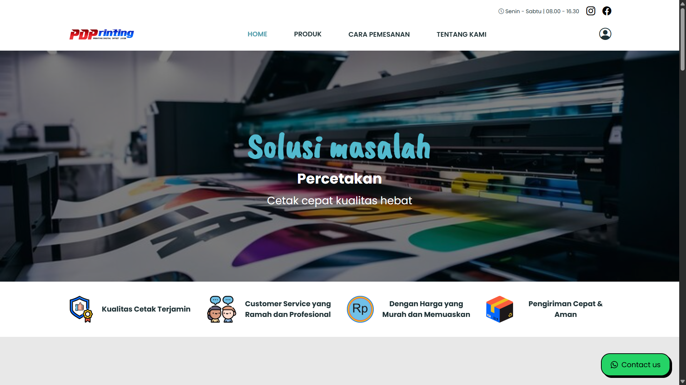

# Manajemen Jasa Percetakan - PDP Printing New

Website ini merupakan hasil implementasi sistem manajemen jasa percetakan berbasis web responsif yang dikembangkan selama kegiatan Praktik Kerja Lapangan (PKL) di PDP Printing New.

## Tampilan Utama

## 📌 Fitur Utama

- ✅ Manajemen data pengguna dan produk
- 🛒 Pemesanan jasa percetakan secara online
- 📦 Pilihan jenis, ukuran, dan metode pengiriman
- 🖼️ Upload file desain cetak langsung di form
- 📊 Laporan pesanan dan pengelolaan data real-time

## 🛠️ Teknologi yang Digunakan

- PHP
- MySQL
- HTML, CSS, JavaScript
- Bootstrap 5
- jQuery (untuk AJAX dan modal)
  
